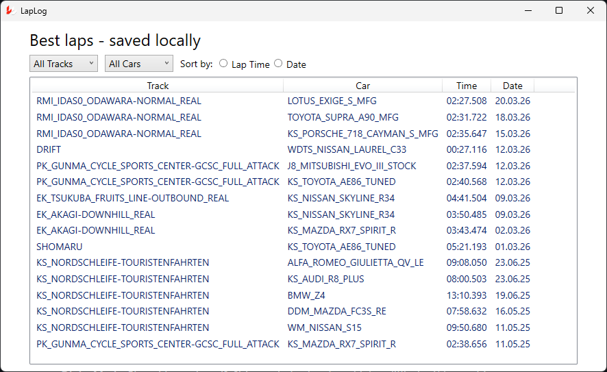
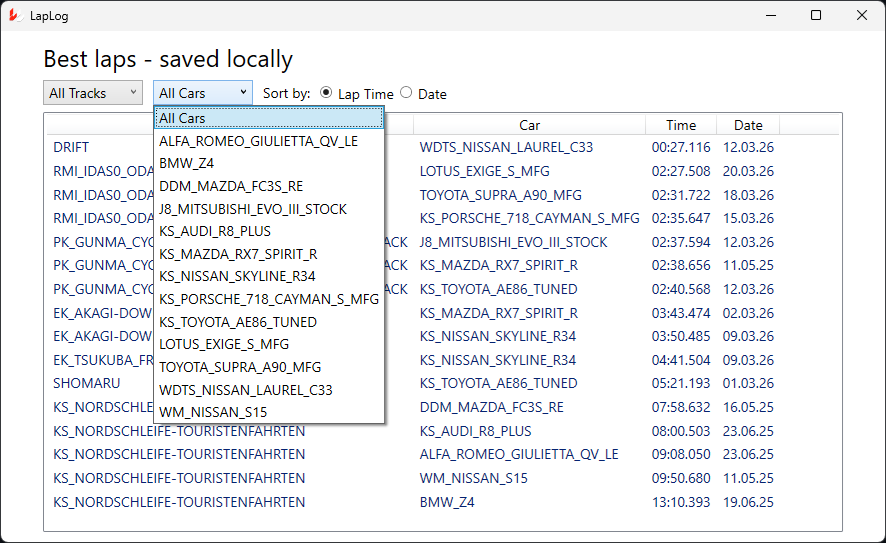
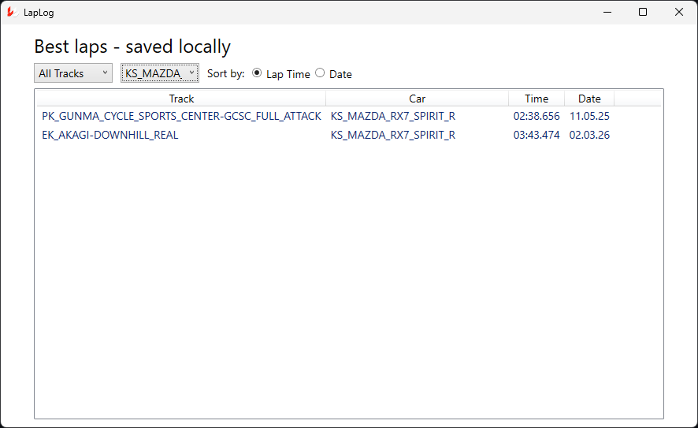
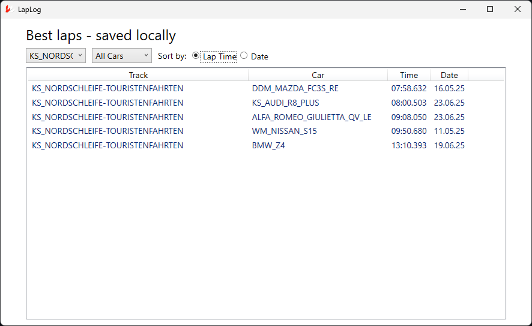

# LapLog
Desktop app that shows your best lap records in game Assetto Corsa

## Features

- See your best lap times without any tinkering. Fast and simple
- Option to filter by particullar track and/or car
- Option to filter by date or lap time

## How to run
Download latest version from [Releases](https://github.com/OzzyTheHuman/AC-LapLog/releases) and run the exe.
You are free to clone this repo and compile it yourself if you want.

## Disclaimer

- Assetto Corsa and any mods or in-game content are the property of their respective owners. It does not include,
distribute, or modify game assets or mods.

- Windows SmartScreen will warn you of potential harmful application. Its because I didnt provide certificate.
There is a plan to release this app in Microsoft Store so this issue will solve itself.

- This app wont work if you dont have <em>personalbest.ini</em> file in <em>MyDocuments/Assetto Corsa</em> directory.

- - - 

<em>Main window</em>

<em>List of available cars and sorting by lap time</em>

<em>Sorting by car and by lap time</em>

<em>Sorting by track and by lap time</em>

